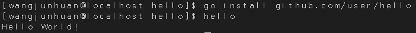

# helloWorld_goLang 安装go语言开发环境
## 一、安装VSCode编辑器
VSCode采用 JavaScript 技术，兼容几乎所有流行的操作系统，特别是对中文支持堪称完美！它不仅是跨平台多语言软件开发工具，而且是 Linux 平台写 Github Flavored Markdown 的神器
- 首先[下载](https://code.visualstudio.com/download)VSCode .rpm安装包
    - 因为CentOS是基于RPM的系统，所以需要下载rpm包，而非deb包（详细见[Linux下软件包的分类及deb、rpm、tar.gz的区别](https://blog.csdn.net/liu865033503/article/details/86014773)）
- 下载成功后在终端打开文件目录，输入以下命令自动安装  
 ` rpm -ivh code-1.38.0-1567548134.el7.x86_64.rpm`
- 成功后在`应用程序`->`编程`中可以看到Visual Studio Code  
    
## 二、安装golang
### 1、安装
-  使用系统包管理工具安装(此处也卡了我一些时间，因为之前安装源没有配置好。[CentOS7配置阿里源方法](https://www.cnblogs.com/muyunren/p/7221505.html))
`sudo yum install golang`
-  检查安装地址
`rpm -ql golang |more`  

-  测试安装(可用于在系统中检查是否搭载go语言环境)   
`go version`
-  结果
`go version go1.11.5 linux/amd64`
### 2、设置环境变量
[go 语言工作空间配置](https://go-zh.org/doc/code.html)
-  创建工作空间(**注意此处需要退出root模式**，否则$HOME指向为`/root`文件夹，不利于后续操作)  
`mkdir $HOME/gowork`
-  配置环境变量
    - 对于CentOS 首先`vim ~/.profile`，之后在文件内添加
    ```
    export GOPATH=$gowork
    export PATH=$PATH:$GOPATH/bin
    ```
    -  此处对GOPATH配置十分重要，也是卡了我较长时间的点。前面如果没有退出root模式，或者没有切换到自己的用户时就很容易出现后续go编译出错。此处区分`GOPATH`、`GOROOT`
        - ` GOPATH`：其实就是我们的工作环境，里面分为`src`、`pkg`、`bin`，分别存放源代码、编译生成的中间文件、bin编译后的可执行文件。前面配置的`$PATH`其实就是这里的bin文件夹，方便我们后续直接运行可执行文件。
        - `GOROOT`：其实就是golang的安装路径，安装好了go语言就不要再动了。一般在`/usr/local/go`（一开始弄乱了GOPATH和GOROOT，导致我的GO代码无法执行）
    -  检查配置  
    `go env`  
    
-  测试程序：Hello World
    - 创建源代码目录（此处遵循goLang的工作环境规则，在src/github.com/下创建个人目录）
    `mkdir $GOPATH/src/github.com/user/hello -p`
    - 使用VSCode创建源代码文件`·hello.go`
    ```
    package main
    import "fmt"
    func main(){
        fmt.Println("Hello World!")
    }
    ```
    - 在终端进入到`$GOPATG/src/github.com/user/hello`运行 `go run hello.go`  
    
### 3、安装必要的工具和插件
-  安装Git客户端  
`sudo yum install git`
- 安装go的一些工具（主要是VSCode提示的GO语言相关工具无法正常访问下载）
```
# 创建文件夹
mkdir $GOPATH/src/golang.org/x/
# 下载源码
go get -d github.com/golang/tools
# copy 
cp $GOPATH/src/github.com/golang/tools $GOPATH/src/golang.org/x/ -rf
```
-  安装工具包  
`go install golang.org/x/tools/go/buildutil`
-  安装运行hello world(此处与前面不同的地方在于前面是运行单个程序，这里是安装项目，生成可执行文件/编译中间文件。**注意路径按照自己实际写**)
```
go install github.com/github-user/hello
hello
```

## 三、